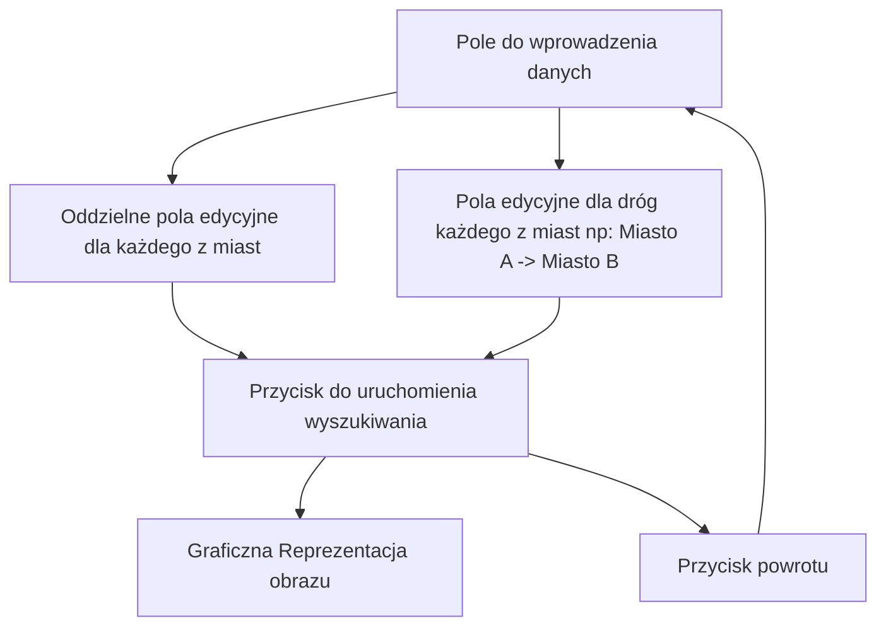
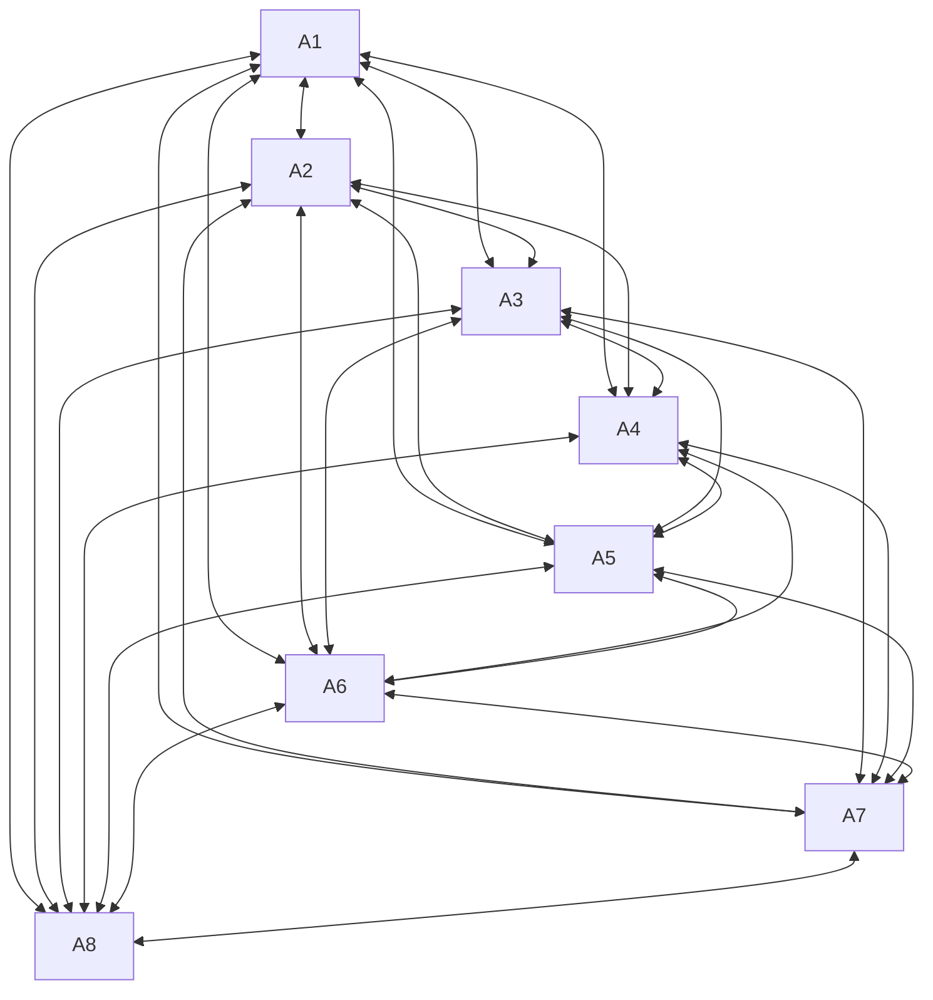

# CitiesTravelling

## Założenia projektu:
### Aplikacja będzie pokazywać najlepszą ścieżkę pomiędzy miastami przy jednoczesnym odwiedzaniu każdego z miast tylko raz.

## Funkcjonalności

- Aplikacja umożliwia wprowadzenie ośmiu miast, które będą uwzględnione w obliczeniach.

- Użytkownik może wybrać dowolne miasto jako punkt startowy oraz dowolne miasto jako punkt końcowy.

- Aplikacja oblicza i wyświetla najkrótszą ścieżkę pomiędzy wybranymi miastami, wraz z listą miast, które należy przejść oraz całkowitym dystansem do pokonania.

- Aplikacja umożliwia również edycję nazw miast oraz długości dróg łączących je.

- Aplikacja automatycznie uzupełnia dane, w przypadku braku ich uzupełnienia przez użytkownika.

## Wygląd

- Aplikacja posiada przyjazny dla użytkownika interfejs, w którym wszystkie opcje są intuicyjnie dostępne.

- Ekran główny zawiera łatwo dostępne pola do wpisania danych.

- Przycisk służący do uruchomienia głównego skryptu programu jest łatwo dostępny i zauważalny od razu po uruchomieniu aplikacji.

- W aplikacji zastosowano estetyczne i spójne ikony oraz grafiki.

- ### Schemat:

## Rozwiązania

- Do obliczenia najkrótszej ścieżki między miastami zostanie wykorzystany Travelling Salesman Problem.

- Aplikacja będzie używała Canvas w celu rysowania graficznej reprezentacji miast oraz ścieżek pomiędzy nimi.

- Aplikacja będzie używała klasy MediaScannerConnection w celu zapisywania wygenerowanych graficznych reprezentacji ścieżek do galerii zdjęć w osobnym albumie.

- Aplikacja będzie używała powiadomień w celu potwierdzenia zapisania zdjęć.

- W celu zwiększenia wydajności i szybkości działania aplikacji, zostanie zastosowana optymalizacja kodu oraz odpowiednie struktury danych.

## Ścieżka miast

